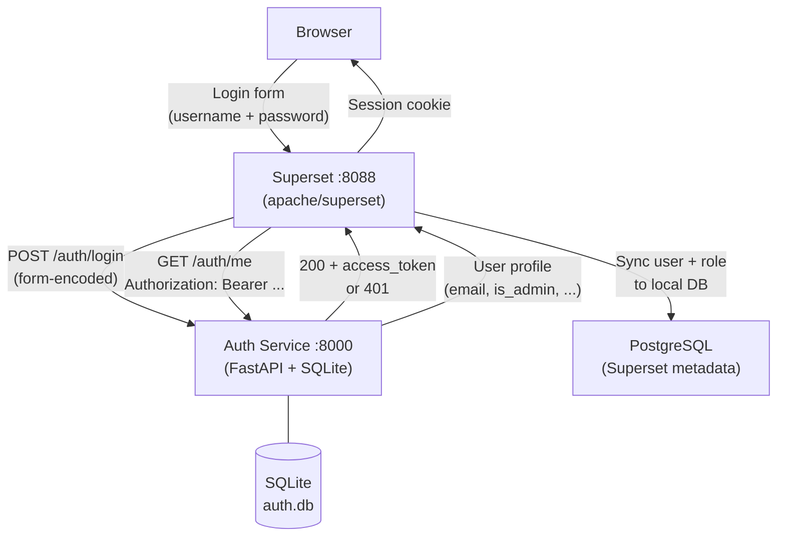
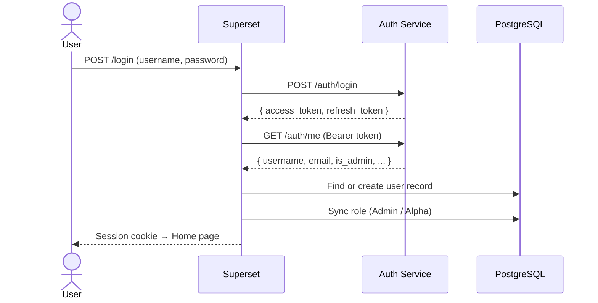

# Superset with Custom Auth Service

Apache Superset configured to delegate all authentication to an external FastAPI service backed by SQLite. Superset itself never validates passwords — it asks the auth service, and on success auto-provisions the user locally for roles and permissions.

---

## Architecture



### Login flow step by step



---

## Services

| Service | Image | Port | Purpose |
|---------|-------|------|---------|
| `auth-service` | `python:3.11-slim` | `8000` | FastAPI auth API, SQLite DB |
| `db` | `postgres:15-alpine` | — | Superset metadata (dashboards, charts, roles) |
| `superset-init` | custom Superset | — | One-shot: migrations, roles, admin bootstrap, load examples |
| `superset` | custom Superset | `8088` | Superset web UI |

---

## Auth Service Endpoints

| Method | Path | Description |
|--------|------|-------------|
| `POST` | `/auth/register` | Create a new user |
| `POST` | `/auth/login` | Login — returns `access_token` + `refresh_token` |
| `POST` | `/auth/logout` | Revoke the current access token |
| `POST` | `/auth/refresh` | Exchange refresh token for a new pair |
| `GET` | `/auth/validate` | Validate a token, returns user info |
| `GET` | `/auth/me` | Current user profile |
| `GET` | `/health` | Liveness probe |

Interactive docs: **http://localhost:8000/docs**

---

## How to Run

### 1. Clone / enter the directory

```bash
cd superset_custom
```

### 2. Create your env file

```bash
cp .env.example .env
```

Edit `.env` and change at minimum:

```env
SUPERSET_SECRET_KEY=<random string>
AUTH_SECRET_KEY=<random string>
ADMIN_PASSWORD=<your password>
```

### 3. Build images

```bash
docker compose build
```

### 4. Start dependencies

```bash
docker compose up -d db auth-service
```

### 5. Run one-time init (migrations + examples + admin bootstrap)

> This downloads example datasets and may take **3–5 minutes**.

```bash
docker compose up superset-init
```

Wait for `Initialisation complete.` then press `Ctrl+C`.

### 6. Start Superset

```bash
docker compose up -d superset
```

Open **http://localhost:8088** and log in with `admin` / `<ADMIN_PASSWORD>`.

---

## Adding New Users

Users are managed through the auth service, **not** through Superset's UI.  
Register a new user via the API:

```bash
curl -X POST http://localhost:8000/auth/register \
  -H "Content-Type: application/json" \
  -d '{
    "username": "alice",
    "email": "alice@example.com",
    "password": "secret",
    "first_name": "Alice",
    "last_name": "Smith",
    "is_admin": false
  }'
```

The user's Superset account is created automatically on their **first login**.  
`is_admin: true` → Superset **Admin** role  
`is_admin: false` → Superset **Alpha** role

---

## Role Mapping

| Auth Service `is_admin` | Superset Role |
|------------------------|---------------|
| `true` | Admin (full access) |
| `false` | Alpha (can create charts/dashboards, no admin settings) |
